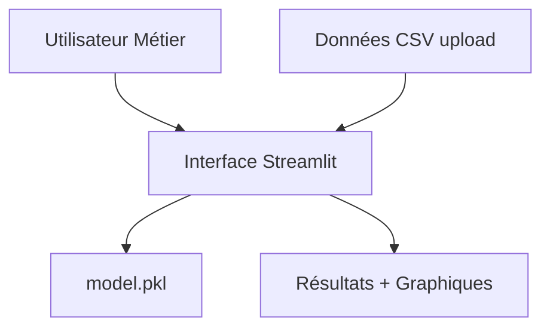
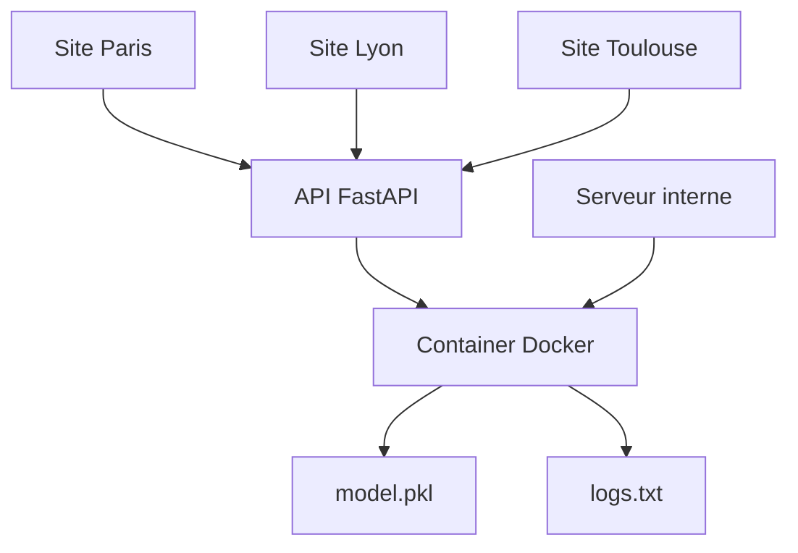
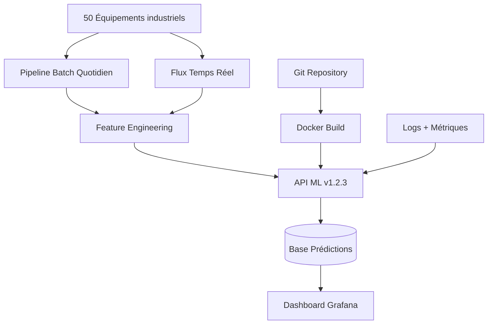
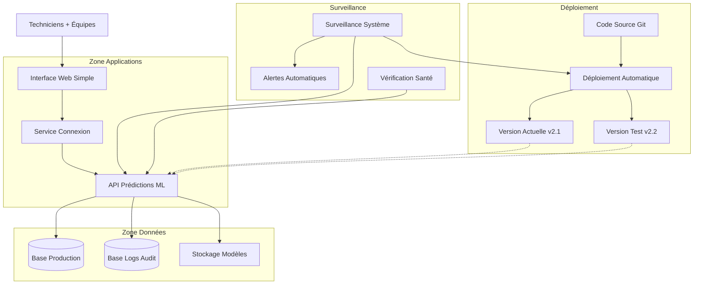

# Correction TP MLOps - Architecture Évolutive

## ÉTAPE 1 – Prototype local Data Scientist

### Nouveau besoin identifié
Un collègue métier (technicien maintenance) doit pouvoir tester le modèle de détection d'anomalies sans installer Python ni manipuler du code.

### Architecture proposée



### Justifications techniques

**Choix Streamlit** : Interface web simple sans développement frontend complexe. Le technicien peut uploader ses fichiers CSV et voir les résultats visuellement.

**Pattern utilisé** : Application web intégrée (selon masterclass - modèle inclus dans l'application)

**Isolation environnement** : 
```bash
python -m venv venv_anomalies
pip install streamlit scikit-learn pandas
```

### Code conceptuel
```python
# app_streamlit.py
import streamlit as st
import joblib
import pandas as pd

model = joblib.load('anomaly_detector.pkl')

uploaded_file = st.file_uploader("Données capteurs", type=['csv'])
if uploaded_file:
    data = pd.read_csv(uploaded_file)
    predictions = model.predict(data)
    st.write("Anomalies détectées:", predictions.sum())
```


## ÉTAPE 2 – Outil interne partagé

### Nouveaux besoins identifiés
- Techniciens sur 3 sites différents (Paris, Lyon, Toulouse)
- Éviter les problèmes "ça marche sur mon PC"
- Accès simultané sans installation locale

### Architecture proposée



### Justifications techniques

**Migration vers API dédiée** : Séparation logique métier/ML, accès concurrent, meilleure robustesse.

**Protocole HTTP/REST** : Standard, firewall-friendly, documentation automatique avec FastAPI.

**Containerisation Docker** : 
- Reproductibilité garantie (même environnement partout)
- Isolation des dépendances
- Déploiement simplifié

**Logs basiques** : Traçabilité minimale pour debugging
```python
logging.basicConfig(filename='predictions.log', level=logging.INFO)
logging.info(f"Prediction for {user_id}: {result}")
```

### Pattern utilisé
Architecture dédiée avec API fonctionnelle (transformation des données capteurs en prédictions d'anomalies)


## ÉTAPE 3 – Démarrage industriel (pré-production)

### Nouveaux besoins identifiés
- Traitement en continu des données de 50 équipements
- Historisation pour analyse des tendances
- Tests de nouvelles versions modèle
- Monitoring performance système

### Architecture proposée



### Justifications techniques

**Pipeline de données structuré** :
- Batch pour analyses historiques (nuit, données complètes)
- Streaming pour alertes temps réel (seuils critiques)

**Versioning sémantique** : v1.2.3 (major.minor.patch)
- Git tags pour traçabilité
- Dockerfile avec version figée des dépendances

**Base de données** : PostgreSQL pour stockage prédictions
```sql
CREATE TABLE predictions (
    id SERIAL PRIMARY KEY,
    equipment_id VARCHAR(50),
    timestamp TIMESTAMP,
    model_version VARCHAR(20),
    anomaly_score FLOAT,
    is_anomaly BOOLEAN
);
```

**Monitoring technique** :
- Latence API (< 100ms cible)
- Taux d'erreur (< 1%)
- Utilisation mémoire/CPU

### Pattern utilisé
Architecture dédiée évoluée avec pipeline ETL et versioning


## ÉTAPE 4 – Mise en production industrielle

### Nouveaux besoins identifiés
- Certification industrielle (traçabilité complète)
- Zéro interruption de service
- Détection automatique de dérive modèle
- Sécurité renforcée (authentification, audit)

### Architecture proposée



### Justifications techniques

**Interface sécurisée** : Connexion obligatoire avec nom d'utilisateur/mot de passe. Chaque action est enregistrée dans les logs d'audit.

**Déploiement sans interruption** :
- Version actuelle continue de fonctionner
- Nouvelle version testée en parallèle
- Basculement automatique si tests OK
- Retour arrière immédiat si problème

**Surveillance automatique** :
- Vérification que l'API répond correctement
- Alerte par email si panne détectée
- Surveillance de la qualité des prédictions

**Base de données séparées** :
- Une pour les résultats de production
- Une pour les logs de sécurité (qui a fait quoi, quand)

**Monitoring métier** :
- Dérive détectée par comparaison distributions
- Alertes automatiques si performance < seuil
- Métriques business (taux détection, faux positifs)

**CI/CD Pipeline** :
```yaml
# .github/workflows/deploy.yml
on: push
jobs:
  test:
    runs-on: ubuntu-latest
    steps:
      - name: Run ML Tests
        run: pytest tests/
  
  deploy:
    needs: test
    steps:
      - name: Build Docker
      - name: Deploy Green
      - name: Health Check
      - name: Switch Traffic
```

**Sécurité renforcée** :
- Chiffrement TLS obligatoire
- Validation stricte inputs (Pydantic)
- Secrets management (variables d'environnement)
- Logs d'audit horodatés et signés

### Pattern utilisé
Architecture microservices avec orchestration complète


## Évolution architecturale - Vue d'ensemble

### Progression logique

1. **Étape 1** : Application monolithique locale (Streamlit intégré)
2. **Étape 2** : Séparation API/Interface (architecture dédiée)
3. **Étape 3** : Pipeline de données + versioning (pré-industriel)
4. **Étape 4** : Microservices + automatisation (production industrielle)

### Transitions justifiées

* **1→2** : Besoin de partage = nécessité d'une API réseau
* **2→3** : Volume/criticité = pipeline robuste + traçabilité
* **3→4** : Industrialisation = automatisation + sécurité + fiabilité

### Technologies utilisées (conforme masterclass)

- **APIs** : FastAPI (performance + documentation)
- **Containerisation** : Docker (reproductibilité)
- **Versioning** : Git + tags sémantiques
- **Monitoring** : Logs + Prometheus (métriques)
- **CI/CD** : GitHub Actions
- **Base données** : PostgreSQL (audit + performance)

### Critères MLOps respectés

* **Reproductibilité** : Docker + versioning Git
* **Scalabilité** : Load balancer + architecture stateless
* **Monitoring** : Métriques techniques + métier
* **Sécurité** : Authentification + chiffrement + audit
* **Automatisation** : CI/CD complet
* **Robustesse** : Tests automatisés + blue/green deployment

### Points critiques identifiés

* **Data drift** : Surveillance automatique distribution features
* **Model decay** : Monitoring performance métier en continu
* **Security** : Principe moindre privilège + logs d'audit
* **Reliability** : SLA 99.9% avec mécanismes failover

> Cette évolution respecte **la philosophie MLOps** :
>
> *Partir simple et complexifier seulement quand le besoin métier le justifie, en maintenant toujours reproductibilité et observabilité.*