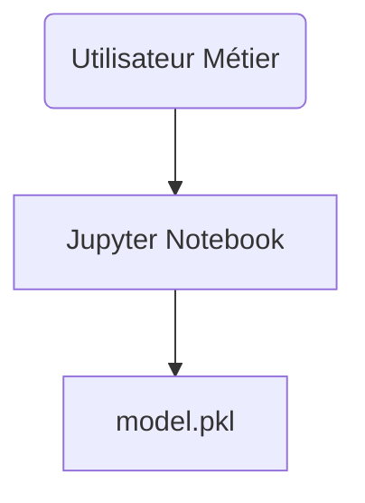

# Mission Architecture MLOps (15 mins)

## Contexte général  
Vous travaillez dans une équipe Data d'un industriel de pointe.  
Votre premier prototype fonctionne en Jupyter – votre mission est de le transformer progressivement en une **solution de détection d’anomalies industrielle**, vouée à être utilisée par différents métiers et équipes.

## Mission  

Pour chaque étape, vous devez :
- Identifier/exprimer le nouveau besoin concret (lié à la réalité industrielle – maintenance, prédiction, rapport, traçabilité…)
- Schématiser l’architecture qui répond à ce besoin (Markdown, feuille, slides…)
- Expliquer vos choix, en restant sur les notions traitées dans la masterclass et dans le parcours de formation
- Envisager soit une évolution incrémentale soit (si justifié) une transition vers une autre architecture

## **ÉTAPE 1 – Prototype local Data Scientist**
Votre modèle fonctionne bien dans un notebook local.  
**Nouveau besoin :** permettre à un collègue métier de faire une prédiction, sans coder lui-même.

## **ÉTAPE 2 – Outil interne partagé**
On veut que plusieurs collègues, localisés sur différents sites, puissent tester le modèle.  
**Nouveau besoin :**
- Rendre la prédiction accessible à distance (web/API sur réseau interne)
- Minimiser les risques de « ça marche ici mais pas là-bas » (Gestion des versions/envs, isolation)
- S’assurer que le code ne plante pas (brique de monitoring basique/log)

## **ÉTAPE 3 – Démarrage industriel (pré-prod)**
Le modèle commence à être utilisé sur de vrais équipements, les jeux de données grossissent.
**Nouveau besoin :**
- Traitement de lots (batch) ou de flux (online) de données capteurs (données périodiques ou Continue Stream/Batch processing)
- Garder trace des inférences (audit, base de données, logs horodatés)
- Faciliter le test et la mise à jour du modèle (versioning, déploiement simple, container)
- Monitorer performance & erreurs base (logging)

## **ÉTAPE 4 – Mise en production industrielle**
L’outil doit être fiable, traçable, sûr, versionnable, auditable.
**Nouveaux besoins :**
- Monitoring métier & modèle (qualité, dérive…)
- Automatisation du déploiement/modèle (CI/CD)
- Gestion fine des accès (ex : API key simple)
- Traçabilité : pouvoir retrouver qui a prédit quoi/avec quelle version de modèle
- Possibilité de rollback rapide

## Consignes
- À chaque étape, faites évoluer votre schéma d’architecture et justifiez vos choix.  
- Utilisez EXCLUSIVEMENT les notions/technos de la masterclass :
    - API Python (Flask, FastAPI)
    - Containerisation Docker
    - Versionning simple (Git, numérotation manuelle)
    - Monitoring/logging (basique, logs texte ou outil vu/mentionné)
    - CI/CD basique (GitHub Actions, Makefile)
    - Base de données ou fichier CSV pour logs/archivage
    - Séparation code/feature engineering (pipeline)

### Exemple de schéma Markdown pour démarrer (prototype)

*Faites évoluer ce schéma à chaque itération.*

### Livrables
- Schéma par étape (+2 phrases d’explication)
- Argumentaire d’évolution sur les patterns (ex : pourquoi passer à une API, pourquoi containeriser...).
- Possibilité variante batch / online (restons sur ce vu dans le cours)

**Présentation finale : 2 min/groupe, fil rouge évolutif, justification centrée sur la sécurité, la robustesse, la reproductibilité, l'intégration métier - tout en restant cohérent avec la feuille de route pédagogique du DS6.**