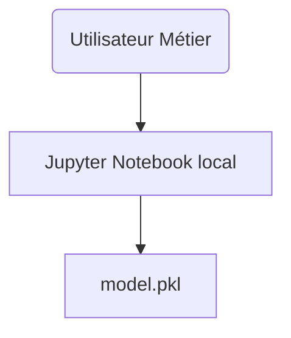

# TP MLOps - Architecture évolutive (15 mins)

## Contexte général  
Vous travaillez dans une équipe Data d'un industriel de pointe.  
Votre premier prototype fonctionne en Jupyter – votre mission est de le transformer progressivement en une **solution de détection d'anomalies industrielle**, vouée à être utilisée par différents métiers et équipes.

## Objectifs pédagogiques
- Comprendre l'évolution progressive d'un prototype vers la production
- Identifier les besoins techniques à chaque étape de maturité
- Appliquer les patterns MLOps appropriés selon le contexte
- Justifier les choix d'architecture par les contraintes métier

## Mission  

Pour chaque étape, vous devez :
- **Identifier** le nouveau besoin concret (lié à la réalité industrielle – maintenance, prédiction, rapport, traçabilité…)
- **Schématiser** l'architecture qui répond à ce besoin (Mermaid, diagramme, slides…)
- **Expliquer** vos choix techniques en vous appuyant sur les notions de la masterclass
- **Justifier** soit une évolution incrémentale soit une transition architecturale

## ÉTAPE 1 – Prototype local Data Scientist
**Situation initiale :** Votre modèle fonctionne bien dans un notebook local.  

**Nouveau besoin :** Permettre à un collègue métier de faire une prédiction, sans coder lui-même.

**Questions à traiter :**
- Comment exposer le modèle sans partager le code ?
- Quelle interface utilisateur simple proposer ?
- Comment maintenir l'isolation de l'environnement ?

## ÉTAPE 2 – Outil interne partagé
**Nouveau contexte :** Plusieurs collègues, localisés sur différents sites, veulent tester le modèle.  

**Nouveaux besoins :**
- Rendre la prédiction accessible à distance
- Minimiser les risques de "ça marche ici mais pas là-bas"
- S'assurer que le code ne plante pas

**Questions techniques :**
- Quel protocole pour l'accès distant ?
- Comment gérer les dépendances et versions ?
- Quels logs minima pour le debugging ?

## ÉTAPE 3 – Démarrage industriel (pré-production)
**Nouveau contexte :** Le modèle est utilisé sur de vrais équipements, les volumes de données augmentent.

**Nouveaux besoins :**
- Traitement de lots (batch) ou flux temps réel de données capteurs
- Garder trace des inférences
- Faciliter les tests et mises à jour du modèle (versioning, déploiement reproductible)
- Monitoring des performances et erreurs

**Questions d'architecture :**
- Comment architecturer le pipeline de données ?
- Quelle stratégie de versioning adopter ?
- Comment organiser les logs pour l'audit ?
- Quels indicateurs surveiller ?

## ÉTAPE 4 – Mise en production industrielle
**Nouveau contexte :** L'outil doit être fiable, traçable, sûr, auditable pour un usage critique.

**Nouveaux besoins :**
- Monitoring métier et technique (qualité modèle, dérive, performance système)
- Automatisation du déploiement et des mises à jour (CI/CD)
- Gestion granulaire des accès et sécurité
- Traçabilité complète : qui a prédit quoi, avec quelle version
- Capacité de rollback rapide en cas de problème

**Questions stratégiques :**
- Comment automatiser le cycle de vie complet ?
- Quelle stratégie de déploiement sans interruption ?
- Comment détecter et réagir aux dérives ?
- Quelle approche pour la sécurité et les accès ?

## Contraintes techniques
Utilisez **EXCLUSIVEMENT** les technologies de la masterclass :
- **APIs :** Flask ou FastAPI
- **Containerisation :** Docker 
- **Versioning :** Git + numérotation manuelle
- **Monitoring :** Logs texte, outils basiques vus en cours
- **CI/CD :** GitHub Actions, Makefile
- **Stockage :** Base de données simple ou fichiers CSV pour logs
- **Pipeline :** Séparation code/feature engineering

## Exemple de schéma

## Livrables attendus

Pour chaque étape :
1. **Diagramme d'architecture** (Mermaid ou équivalent)
2. **Justification technique** (2-3 phrases par choix majeur)
3. **Pattern utilisé** et pourquoi (API REST, containerisation, etc.)
4. **Évolution** par rapport à l'étape précédente

## Présentation finale (2 minutes/groupe)
- **Fil rouge évolutif** montrant la progression
- **Justifications centrées** sur : sécurité, robustesse, reproductibilité, intégration métier
- **Cohérence** avec la feuille de route pédagogique

## Critères d'évaluation
- **Pertinence** des choix techniques selon le contexte
- **Justification** des évolutions architecturales
- **Utilisation appropriée** des technologies de la masterclass
- **Progression logique** entre les étapes
- **Réalisme** des solutions proposées